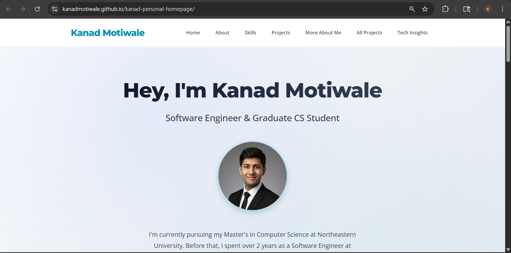

# Kanad Motiwale - Personal Homepage

## About

**Kanad Motiwale** - Graduate Computer Science Student at Northeastern University  
**Course:** Web Development - CS 5610

## What This Is

My personal homepage showcasing my software engineering background, projects, and skills. Built from scratch using vanilla HTML, CSS, and JavaScript to demonstrate modern web development practices.

## Screenshot



_Homepage featuring animated skill bars and responsive design_

## Key Features

- **Animated Skill Bars**: Interactive progress bars that animate when you scroll to them
- **Responsive Design**: Works great on phones, tablets, and desktops
- **Real Projects**: Showcasing my actual work from LTIMindtree and FastFindFirm
- **Clean Code**: ES6 modules, semantic HTML, and modern CSS Grid/Flexbox

## Tech Stack

- **Frontend**: HTML5, CSS3, JavaScript ES6+
- **Development**: Node.js, ESLint, Prettier
- **Deployment**: GitHub Pages

## Project Structure

```
personal-homepage/
├── index.html              # Main page
├── about.html              # Detailed background
├── projects.html           # Project showcase
├── ai-generated.html       # Tech insights page
├── css/
│   └── styles.css         # All the styling
├── js/
│   ├── main.js           # Main functionality
│   ├── features.js       # Animated features
│   └── utils.js          # Helper functions
├── images/               # Placeholder images
├── package.json         # Dependencies
├── LICENSE             # MIT License
└── README.md          # This file
```

## Getting Started

### Prerequisites

- Node.js (16+)
- npm (8+)
- Any modern web browser

### Setup

1. **Clone it**

   ```bash
   git clone https://github.com/kanadmotiwale/personal-homepage.git
   cd personal-homepage
   ```

2. **Install dependencies**

   ```bash
   npm install
   ```

3. **Start development server**

   ```bash
   npm start
   ```

4. **Open your browser**
   - Goes to `http://localhost:3000` automatically
   - Or visit manually if it doesn't

### Development Commands

```bash
npm run lint          # Check for JavaScript issues
npm run lint:fix      # Auto-fix what can be fixed
npm run format        # Format code with Prettier
```

### Deploy

This is a static site, so you can:

- Upload files to any web server
- Use GitHub Pages (already set up)
- Deploy to Netlify or Vercel

## My Background

### Education

- **MS Computer Science** - Northeastern University (2025-2027, GPA: 3.9)
- **BE Electronics & Telecom** - Ramrao Adik Institute, Mumbai (2019-2023)

### Work Experience

- **Software Engineer** - LTIMindtree (2023-2025)
- **Co-founder** - FastFindFirm (2022-2023, 5K+ users)
- **Software Engineering Intern** - LTIMindtree (2023)

### Skills I'm Good At

- **Backend**: Java, Node.js, Python, REST APIs, Microservices
- **Databases**: PostgreSQL, MongoDB, MySQL
- **Cloud**: AWS Lambda, EC2, S3, CI/CD with Jenkins
- **Frontend**: JavaScript, HTML/CSS, Angular
- **Tools**: Git, Docker, Linux

## Real Projects Featured

### FastFindFirm Ed-tech Platform

Co-founded and built this from scratch. Grew to 5,000+ users with Node.js backend, Python analytics, and microservices architecture. The scaling challenges taught me a lot about system design.

### PPM Platform at LTIMindtree

Built workflow automation that reduced manual operations by 40%. Used MEAN stack and learned tons about enterprise database design.

### Java Calendar Application

Course project that I got really into. Three different interfaces (GUI, CLI, headless), clean MVC architecture, and comprehensive JUnit tests.

## AI Usage Disclosure

I used Claude AI to help with content generation for the "Tech Insights" page and to get feedback on code structure. The AI helped with:

- Writing the web development trends article
- Suggesting best practices for ES6 modules
- Code review and optimization tips

All the personal content, project descriptions, and technical details are my own experiences. The AI just helped with articulation and structure.

## Live Demo

**Website:** https://kanadmotiwale.github.io/kanad-personal-homepage/

## Code Quality

- ESLint compliant (no errors)
- Prettier formatted
- W3C HTML valid
- All images have alt text
- Responsive design tested
- Cross-browser compatible

## Contact

- **Email:** motiwale.k@northeastern.edu
- **LinkedIn:** [linkedin.com/in/kanadmotiwale](https://linkedin.com/in/kanadmotiwale)
- **GitHub:** [github.com/kanadmotiwale](https://github.com/kanadmotiwale)

## License

MIT License - feel free to use this code for your own portfolio.

---

Built with vanilla HTML, CSS, and JavaScript. No frameworks, no fluff.
